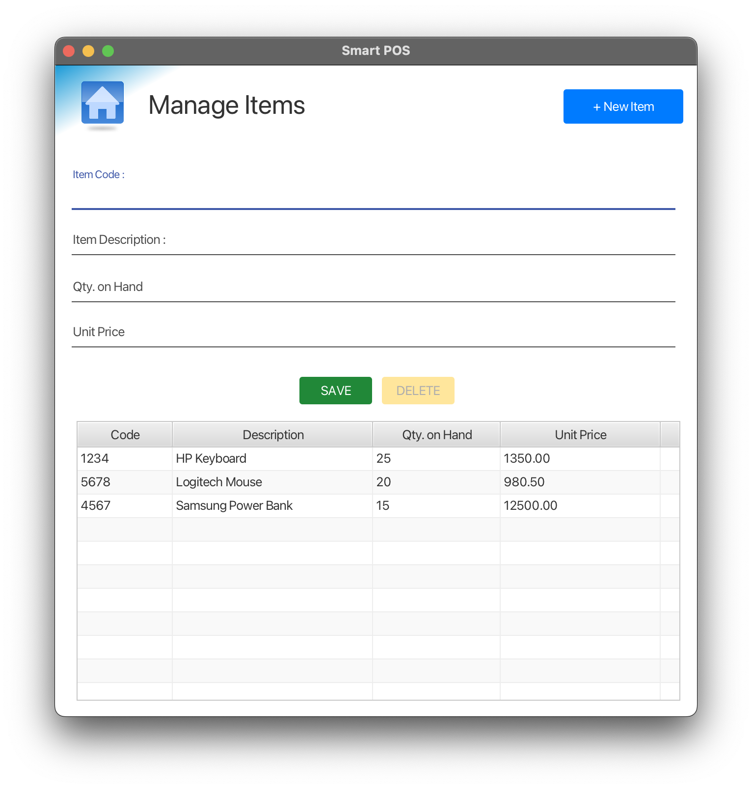

# Smart POS


## Table of Contents

- [Description](#description)
- [Features](#features)
- [Screenshots](#screenshots)
- [Usage](#usage)
- [Technologies Used](#technologies-used)
- [Installation](#installation)
- [Contributing](#contributing)
- [License](#license)
- [Contact](#contact)
- [Version](#version)

## Description

Revolutionizing retail with intuitive, all-in-one point of sale software. Seamlessly manage transactions, inventory, and customer relations with cutting-edge efficiency. Designed for the modern business. Elevate your sales experience.

## Features

- User-friendly interface for easy transactions
- Inventory management to track products
- Sales reports generation
- **Manage Customers**: Ability to add, edit, and remove customer information.
- **Manage Items**: Facility to add, update, or delete items in the inventory.
- **Place Order**: Capability to create and process orders for customers.
- **Search Order**: Functionality to search for and view past orders.

## Screenshots

### Manage Customers


### Manage Items



### Place Order


### Search Order


### POS Bill


## Usage

- Access the application through the GUI interface provided by JavaFX.
- Utilize the provided functionalities for managing customers, items, placing orders, and searching orders.

## Technologies Used

- Java 11
- JavaFX
- JDBC (Java Database Connectivity)
- PostgreSQL
- JUnit (for testing)
- CSS

## Installation

To run this project locally, follow these steps:

1. Clone the repository:
git clone https://github.com/Lakith-Rathnayake/smart-pos
2. Open the project in IntelliJ IDEA (or any IDE of your choice) as a Maven project.

3. Create a PostgreSQL database for the application.

4. Add the database details (URL, username, password) to the `application.properties` file. For example:
 ```
 app.datasource.url=jdbc:postgresql://localhost:5432/your_database_name
 app.datasource.username=your_username
 app.datasource.password=your_password
 ```

5. Install dependencies by building the project using Maven:
mvn clean install
6. Configure the project with Java 11, JavaFX, and PostgreSQL.

7. Locate the `AppInitializeWrapper` class and run its main method to start the application.

## Contributing

If you'd like to contribute to this project, please follow these steps:

1. Fork the repository
2. Create a new branch (`git checkout -b feature/your-feature`)
3. Make your changes
4. Commit your changes (`git commit -m 'Add some feature'`)
5. Push to the branch (`git push origin feature/your-feature`)
6. Create a new pull request

## License
Copyright &copy; 2023 Lakith Rathnyake. All Rights Reserved.
This project is licensed under the [MIT License](LICENSE.txt).

## Contact

For any inquiries or support, feel free to contact the project maintainer:

- Name: [Lakith Rathnayake](https://github.com/Lakith-Rathnayake)
- Email: lakithpathmila@gmail.com
- LinkedIn: [Lakith Rathnayake](https://www.linkedin.com/in/lakith-rathnayake/)

## Version

- Project Version: 1.0.0